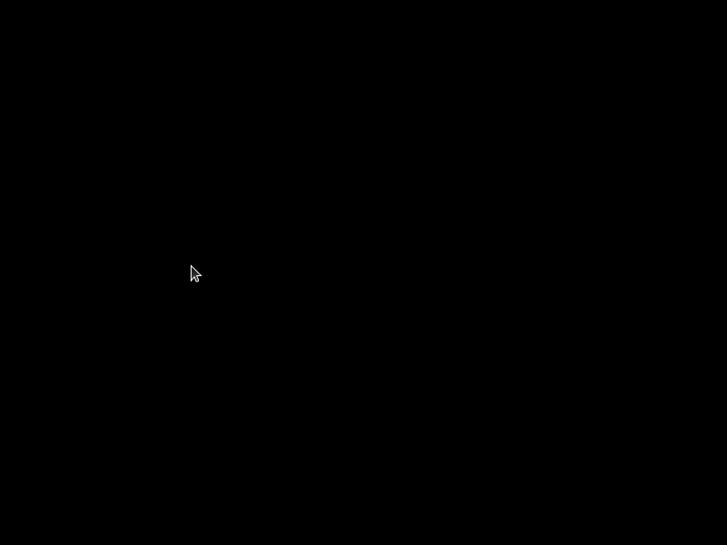

# N-Body Simulation
An [N-Body Simulation](https://en.wikipedia.org/wiki/N-body_simulation) approximates the solution to an instance of the [N-Body Problem](https://en.wikipedia.org/wiki/N-body_problem). In this program, you can add bodies by clicking on the screen, and their positions will be updated using the simulation engine.  

## Why you should contribute 😀
If you're trying to learn programming but you're in that weird intermediate stage where the tutorials are too easy, but you're not sure how to start your own project, this would be the perfect opportunity for you to learn some C++ in the context of a practical project while gaining some open source contribution experience. 

If you're interested in working on this, but not sure what to do, feel free to drop a comment in the issues section and I'll reach out to you to discuss it in more detail. 

## Motivation
The principle of emergent behavior has always fascinated me. How a simple rule can result in quite complicated system behavior over time. One example that we feel every day and have a good intuition for is gravity. This single, simple equation: `F = G*(mass1*mass2) / (radius**2)` explains not only why apples fall downwards, but also a great deal of astrophysics; the movement of our Sun, Moon, planets, spaceships, galaxies, superclusters of galaxies, etc. 

## Why C++?
I know, it kind of really sucks to work with. But it's fast, and it's used in a lot of places, so I wanted to gain some experience in writing object-oriented C++. 

## Next Steps
I don't have the time to keep building on this idea, but I think it would be really cool if it had some more advanced features. Right now it's a very simple C++ project without many bells and whistles, but you can change that! Here's some ideas for features that you could work on: 

- Ability to pause/play simulation using button or keypress 
- Improve visualization, since it's kind of bad right now  
- User configurability (right now masses are randomly generated)
- Improve accuracy (right now the engine is built on the stupidly simple [Euler's Method](https://x-engineer.org/euler-integration/#:~:text=The%20Euler%20method%20is%20a,proportional%20to%20the%20step%20size.), but maybe upgrading to something like [Runge-Kutta Methods](https://en.wikipedia.org/wiki/Runge%E2%80%93Kutta_methods) ) would make it more accurate.
- Implement [Barnes-Hut Algorithm](http://arborjs.org/docs/barnes-hut) to reduce runtime complexity from `O(n**2)` to `O(nlogn)`

In order to improve the visualization and add more user interaction, it might be needed to upgrade to a better GUI library that comes with a windowing system. Right now the project uses [SDL](https://www.libsdl.org/) which might prove to be a limitation for some of the more advanced features. We will probably need to perform a migration at some point in the future. 

## Contributors
If you've helped with this project, drop your github username here!
- ausaf-a

